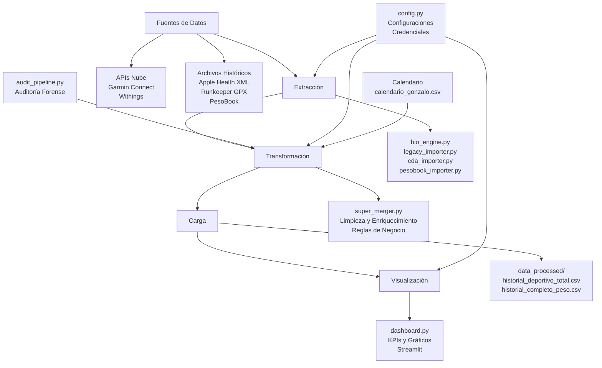

# Arquitectura del Bio-Engine

## Diagrama de Flujo de Datos

## Componentes Principales

### Capa de Extracción
- **bio_engine.py**: Conector principal con APIs externas
  - Garmin: Extracción de actividades con métricas biomecánicas
  - Withings: Datos de peso y composición corporal
  - Estrategias de paginación y manejo de errores

- **Módulos Legacy**:
  - `legacy_importer.py`: Procesamiento de archivos históricos
  - `cda_importer.py`: Datos CDA de Apple Health
  - `pesobook_importer.py`: Importación de PesoBook

### Capa de Transformación
- **super_merger.py**: Motor de fusión inteligente
  - Limpieza de datos con reglas de negocio
  - Enriquecimiento con calendario de carreras
  - Asignación automática de calzado

- **audit_pipeline.py**: Validador de integridad
  - Auditoría forense input vs output
  - Detección de pérdidas de datos

### Capa de Almacenamiento
- **Data Warehouse**: Carpeta `data_processed/`
  - Archivos maestros consolidados
  - Formato CSV con separador ';'
  - Índices por fecha para consultas eficientes

### Capa de Visualización
- **dashboard.py**: Interfaz web Streamlit
  - KPIs de eficiencia y rendimiento
  - Gráficos interactivos con Altair
  - Filtros dinámicos por fecha

### Configuración Central
- **config.py**: Punto único de configuración
  - Credenciales de APIs
  - Rutas de archivos
  - Perfiles de usuario
  - Umbrales biomecánicos

## Flujo Operativo

1. **Sincronización Diaria**:
   - Usuario presiona "Sincronizar" en dashboard
   - `cloud_sync.py` coordina extracción
   - Datos nuevos se fusionan con históricos
   - Dashboard se actualiza automáticamente

2. **Procesamiento por Lotes**:
   - Archivos legacy se procesan una vez
   - APIs se consultan periódicamente
   - Calendario se actualiza manualmente

3. **Auditoría Continua**:
   - Pipeline valida integridad después de cada fusión
   - Reportes de anomalías se generan automáticamente

## Consideraciones Técnicas

- **Idempotencia**: Las operaciones se pueden repetir sin efectos secundarios
- **Robustez**: Manejo de errores evita fallos totales del sistema
- **Escalabilidad**: Arquitectura modular permite agregar nuevas fuentes
- **Seguridad**: Credenciales centralizadas (mejorar con variables de entorno)