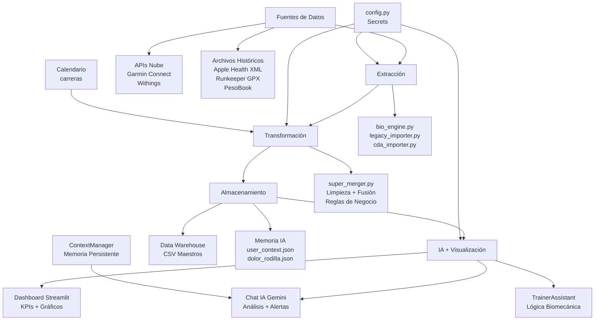

# Bio-Engine - Arquitectura del Sistema (v2.0)

> **Actualizado:** 19-01-2026 | **Ver estado completo:** `ESTADO_ACTUAL.md`

## Diagrama de Flujo de Datos (CON IA)



## Componentes Principales ACTUALIZADOS

### ✅ Capa de Extracción (Completada)
- **bio_engine.py**: Conector con APIs externas
  - Garmin: Actividades con métricas biomecánicas
  - Withings: Peso y composición corporal
  - Estrategias de paginación y manejo de errores

- **Módulos Legacy** (Completados):
  - `legacy_importer.py`: Procesamiento históricos
  - `cda_importer.py`: Apple Health XML
  - `pesobook_importer.py`: Importación PesoBook
  - `runkeeper_extractor.py`: GPX de Runkeeper

### ✅ Capa de Transformación (Completada)
- **super_merger.py**: Motor de fusión inteligente
  - Limpieza con reglas de negocio
  - Enriquecimiento con calendario
  - Asignación automática de calzado

- **audit_pipeline.py**: Validador de integridad
  - Auditoría forense input/output
  - Detección de pérdidas de datos

### ✅ Capa de Almacenamiento (Completada + Expandida)
- **Data Warehouse CSV**: `data_processed/`
  - Archivos maestros consolidados
  - Formato: CSV separador ';', decimal ','
  - Índices por fecha

- **🆕 Memoria Persistente IA**: `data_cloud_sync/`
  - `user_context.json`: Perfil, estadísticas, insights aprendidos
  - `dolor_rodilla.json`: Tracking histórico de dolor

### ✅ Capa de IA y Visualización (NUEVA - Completada)

#### **1. TrainerAssistant (`trainer_assistant.py`)**
Motor de análisis biomecánico:
- Análisis de sesiones de entrenamiento
- Alertas de tendinosis cuadricipital
- Detección de sobreentrenamiento
- Alertas de desgaste de zapatillas (>500km)
- Generación de planes de entrenamiento en 3 fases

#### **2. LLMClient (`llm_client.py`)**
Cliente Gemini API con:
- Prompts especializados en biomecánica
- Memoria conversacional (últimos 5 mensajes)
- Contexto enriquecido (plan, actividades, contexto usuario)
- Detección de intenciones (modificar plan, consultas)

#### **3. ContextManager (`context_manager.py`)**
Gestor de memoria persistente:
- CRUD de `user_context.json`
- Actualización de estadísticas
- Registro de insights aprendidos
- Logging de conversaciones relevantes
- Formateo de contexto para LLM

#### **4. Dashboard Components (`dashboard_components.py`)**
Componentes UI:
- Chat interface integrada
- Detección de dolor de rodilla en mensajes
- Modificación de plan vía NLP
- Visualización de métricas

#### **5. Dashboard Principal (`dashboard.py`)**
Interfaz Streamlit:
- KPIs de eficiencia y rendimiento
- Gráficos interactivos (Altair, Plotly)
- Filtros dinámicos
- Sincronización automática

### Configuración Central
- **config.py**: Configuración local
- **`.streamlit/secrets.toml`**: API keys (Gemini, Garmin, Withings)
- **`.streamlit/config.toml`**: Configuración Streamlit

---

## Flujo Operativo ACTUALIZADO

### 1. Sincronización Diaria
```
Usuario → Dashboard → Botón "Sincronizar"
          ↓
    cloud_sync.py coordina
          ↓
    ┌─────────────┬─────────────┐
    ↓             ↓             ↓
Garmin API   Withings API   Legacy
    ↓             ↓             ↓
    └─────────────┴─────────────┘
                  ↓
          super_merger.py
                  ↓
    ┌─────────────┴─────────────┐
    ↓                           ↓
CSV Maestros            ContextManager
                        (actualiza stats)
                  ↓
          Dashboard refresca
```

### 2. Interacción con Chat IA
```
Usuario escribe mensaje
        ↓
dashboard_components.py
        ↓
    ┌───┴────┐
    ↓        ↓
Detecta  LLMClient
intención    ↓
    ↓    Contexto completo:
    ↓    - Plan actual
    ↓    - Actividades recientes (7d)
    ↓    - user_context.json
    ↓    - Historial conversación
    ↓        ↓
    ↓    Gemini API
    ↓        ↓
    └────┬───┘
         ↓
    Respuesta + Acción
         ↓
    ┌────┴────┐
    ↓         ↓
Modificar  Registrar
plan       dolor
```

### 3. Aprendizaje Continuo
```
Nueva actividad → ContextManager actualiza stats
Conversación → Detecta pattern → Guarda insight
Dolor registrado → Actualiza tendencia en context
```

---

## Consideraciones Técnicas

### ✅ Implementado
- **Idempotencia**: Operaciones repetibles sin efectos secundarios
- **Robustez**: Manejo de errores evita fallos totales
- **Escalabilidad**: Arquitectura modular
- **Seguridad**: Secrets en `.streamlit/secrets.toml`
- **Memoria persistente**: JSON con contexto del usuario
- **IA conversacional**: Integración Gemini con contexto rico

### ⏳ Pendiente
- **Cloud Sync**: Migración a Google Sheets/Drive
- **Auto-ML**: Detección automática de patrones
- **Notificaciones**: Email/WhatsApp con alertas

---

## Nuevos Archivos Creados

```
BioEngine_Gonzalo/
├── trainer_assistant.py       # 🆕 Motor de análisis biomecánico
├── llm_client.py               # 🆕 Cliente Gemini API
├── context_manager.py          # 🆕 Gestor de memoria persistente
├── dashboard_components.py     # 🆕 Componentes UI con chat
├── data_cloud_sync/            # 🆕 Carpeta datos persistentes
│   ├── user_context.json       # 🆕 Contexto usuario
│   └── dolor_rodilla.json      # 🆕 Tracking dolor
├── config/
│   ├── plan_entrenamiento.json # 🆕 Plan generado por IA
│   └── protocolo_medico.txt    # 🆕 Protocolo tendinosis
```

---

## Dependencias Actualizadas

**Nuevas en `requirements.txt`:**
- `google-genai` - Gemini API
- `streamlit-authenticator` - Login

**Total de integraciones:**
- 2 APIs activas (Garmin, Withings)
- 3 fuentes legacy (Apple, Runkeeper, PesoBook)
- 1 LLM (Gemini)

---

**Versión:** 2.0 (con Chat IA)  
**Estado:** Producción - Streamlit Cloud  
**Ver estado completo:** `ESTADO_ACTUAL.md`